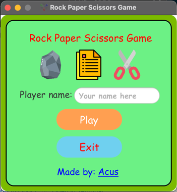

# Rock Paper Scissors Game

- This is a simple game from my childhood's memory (Just for fun project)
- Project link (GitHub) : https://github.com/AcusPGP/RockPaperScissors
- Project's author: Pham Gia Phuc - "Acus" (Personal profile: https://github.com/AcusPGP)

-----------------------------------
<ins>

### USER GUIDE

</ins>

### STEP 1: Before running the program, you make sure your computer already installed tools below

- JDK version 18.0.2 or later
- Maven version 4.0.0 or later
- JFX version 18.0.2 or later

> I recommend JDK and JFX version must be match in order to have full experience to run the program successfully.

### STEP 2: Run the program

- To run **the game**, go to: [src/main/java/com/example/rockpaperscissors/Hello.java](src/main/java/com/example/rockpaperscissors/Hello.java)

-----------------------------------
<ins>

### GAME PICTURES

</ins>

- **Welcome stage:**
 

- **Play stage:**

